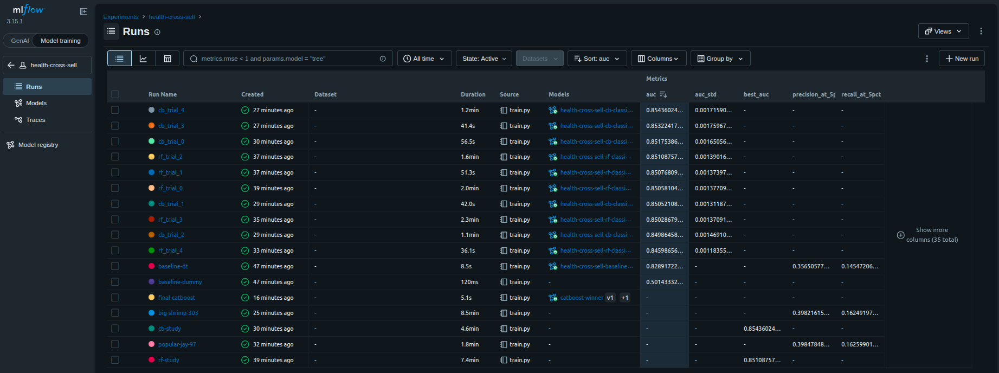
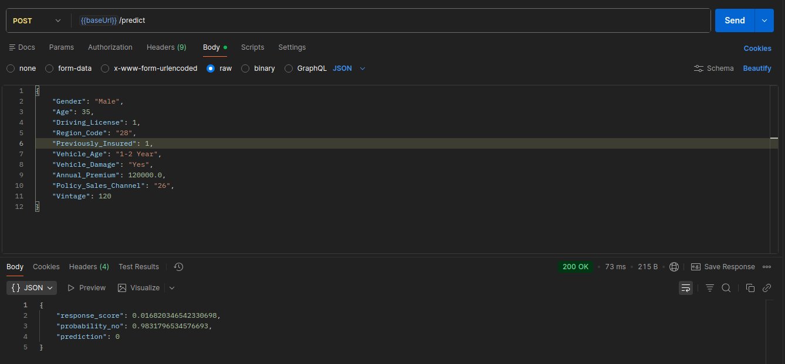

Modelo de classificação binária para **venda de seguro de veículo** para clientes atuais de seguro de saúde.

**Objetivo do modelo:** prever `Response` (1 = cliente com propensão a contratar seguro de veículo, 0 = caso contrário), tratado como problema de **ranking por probabilidade** para priorizar o contato da equipe de vendas. Métrica principal: **ROC-AUC**, complementada por precision at k e recall at k.

## Stack

- **EDA:** notebook `src/eda.py`
- **Treino:** notebook `src/train.py` (Optuna + MLflow)
- **Experiment tracking:** MLflow via Docker
- **Serving:** FastAPI (`api/`)

## Estrutura

```
.
├── data/            # datasets (train/test) — não versionado
├── src/             # EDA e pipeline de treino
│   ├── eda.py       # análise exploratória dos dados
│   └── train.py     # treino, tuning (Optuna) e registro no MLflow
├── api/             # FastAPI de serving
├── assets/          # imagens (MLflow, testes da API)
├── mlflow/          # volume do servidor MLflow (backend + artefatos) — não versionado
├── docker-compose.yml
├── .env.example
└── pyproject.toml   # projeto uv
```

Variáveis de ambiente (`.env`):

| Variável | Descrição |
|---|---|
| `MLFLOW_TRACKING_URI` | URI do servidor MLflow (padrão `http://localhost:5000`) |
| `MLFLOW_EXPERIMENT_NAME` | Experimento registrado (`health-cross-sell`) |
| `MODEL_NAME` | Nome do modelo registrado carregado pela API |
| `MODEL_ALIAS` | Alias do modelo registrado (ex.: `catboostwinner`) |

## Análise exploratória (`src/eda.py`)

- Cerca de 88% dos clientes têm Response=0. Portanto, o **dataset é desbalanceado**. Acurácia é métrica enganosa.
- Previously_Insured=1 nunca contrata novo seguro: feature altamente discriminante.
- Candidatas a novas features: `prev_and_damage`, `log_annual_premium`, faixas de idade, frequência de `Region_Code` e `Policy_Sales_Channel`.

## Treino (`src/train.py`)

Pipeline de pré-processamento via `ColumnTransformer` + `feature_engine`:

- `Vehicle_Age` é ordinal, `Vehicle_Damage` e `Gender` passam por one-hot encoding.
- `Age` é discretizada em 5 bins, `Region_Code` e `Policy_Sales_Channel` passam por encoding por frequência.
- Features criadas: `prev_and_damage` e `log_annual_premium`.

Modelos avaliados com **validação cruzada estratificada**:

| Modelo | AUC (CV) |
|---|---|
| Dummy (baseline) | ~0.5 |
| Decision Tree | baseline interpretável |
| Random Forest (Optuna) | 0.8510 |
| **CatBoost (Optuna)** | **0.8543** |

**Modelo final: CatBoost** com AUC média de CV 0.8652.



## Serving (FastAPI)

API em `api/` que carrega o modelo registrado no MLflow via `models:/{MODEL_NAME}@{MODEL_ALIAS}`.

```bash
# Iniciar a API
uvicorn api.main:app --reload
# Docs interativos: http://localhost:8000/docs
```

### Endpoints

| Método | Rota | Descrição |
|---|---|---|
| `GET` | `/health` | Status da API e URI do modelo carregado |
| `POST` | `/predict` | Predição individual de propensão |
| `POST` | `/predict/batch` | Predição em lote |

Exemplo de corpo para `/predict`:

```json
{
  "Gender": "Male",
  "Age": 45,
  "Driving_License": 1,
  "Region_Code": "28",
  "Previously_Insured": 0,
  "Vehicle_Age": "> 2 Years",
  "Vehicle_Damage": "Yes",
  "Annual_Premium": 50000,
  "Policy_Sales_Channel": "152",
  "Vintage": 120
}
```

Resposta:

```json
{
  "response_score": 0.87,
  "probability_no": 0.13,
  "prediction": 1
}
```



## Observações

- O backend do MLflow é **SQLite** e os artefatos ficam em volume local (`./mlflow/artifacts`) — arquitetura de container único para projeto pessoal.
- O volume monta `./mlflow` no **mesmo caminho absoluto** dentro do container. Isso faz com que o `artifact_uri` `file://.../mlflow/artifacts` resolva para o mesmo diretório tanto no cliente (host) quanto no servidor. Se mudar o projeto de lugar, ajuste esse caminho em `docker-compose.yml`.
- Limitações: dataset desbalanceado (~12% de positivos), AUC na faixa de 0.85–0.86 com difícil progressão.
